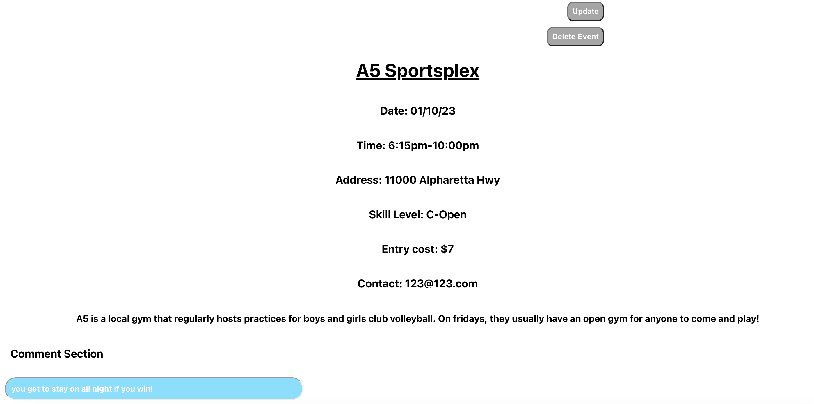

# **OpenGym**
## **Date**: 02/09/2023
### **By**: Anatoliy Agadzhanov
#### [GitHub](https://github.com/yesanatoliy) | [LinkedIn](https://www.linkedin.com/in/anatoliy-agadzhanov-5a2a54173/)
***
### ***Description***
OpenGym is an website for volleyball players to find information about local events where they can sign up to play volleyball! Players who run these events can also use OpenGym to create event listings to promote their events. You can see the deployed version [here](https://opengym-app.herokuapp.com/)

***
### ***Technologies Used***
* React
    * JSX
* Express
* JavaScript
* MongoDB
    * Mongo Atlas
    * Mongo Compass
    * Insomnia
* CSS
* HTML
***
### ***Screenshots***

#### **Login**

#### **Event page**

***
### ***Future Updates***
- [ ] CRUD for every entity
- [ ] Add search
- [ ] Add profile pictures
- [x] Add event pictures
- [ ] Add login option
- [ ] Only render events that have not occured yet
- [ ] Add confirm prompts for important updates or deletes
- [ ] Attach username and icon next to their comments and their events
- [x] True user authentication
- [ ] Nicer font
- [ ] Add images to buttons instead of text
- [ ] Button collection
- [ ] More enticing signup page, include preview of site?
- [ ] Sleeker favicon.ico
- [ ] Add images to navbar
- [ ] Dark theme
- [ ] Show comments button on events and add comments button on event list
- [ ] More animations
***
### ***Credits***

[Deployed App](https://opengym-app.herokuapp.com/)

Volleyball Images: [istock clipart](https://www.istockphoto.com/illustrations/black-and-white-volleyball-net) , [unsplash.com search](https://images.unsplash.com/photo-1553005746-9245ba190489?ixlib=rb-4.0.3&ixid=MnwxMjA3fDB8MHxwaG90by1wYWdlfHx8fGVufDB8fHx8&auto=format&fit=crop&w=1470&q=80)

Favicon generator: [favicon.io](https://favicon.io/favicon-converter/)

CSS Guides: [w3 schools css guide](https://www.w3schools.com/css/default.asp), [w3 schools css animations guide](https://www.w3schools.com/css/css3_animations.asp)

